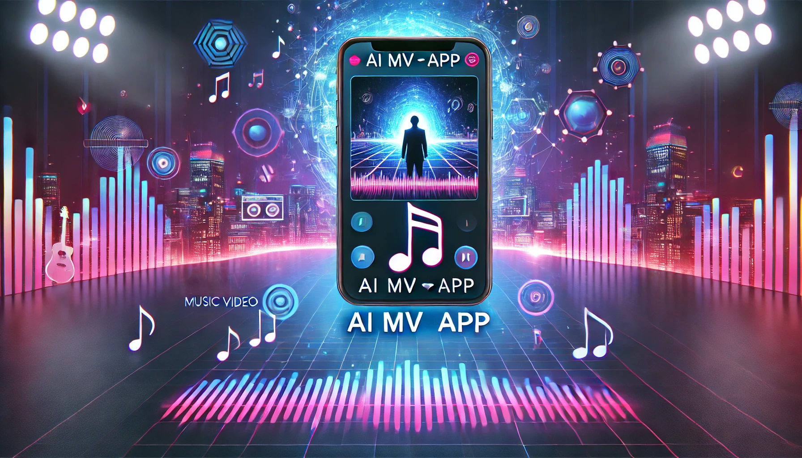

# 📌 AI MV 製作 App - README

這是一款基於 React Native 開發的 AI MV 製作應用，透過 AI 背景去背 和 AI 生成 MV 背景，讓創作者輕鬆製作高品質音樂影片。

## 🚀 主要功能

✅ 影片錄製（React Native Vision Camera）  
✅ AI 背景去背（MODNet / RVM）  
✅ AI 生成 MV 背景（Stable Diffusion / ControlNet）  
✅ 影片剪輯（FFmpeg：裁剪、濾鏡、音量調整）  
✅ 影片上傳（Firebase Storage）  
✅ 社群分享（YouTube、Facebook、TikTok）

